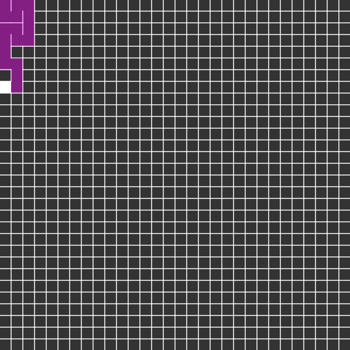

# Maze Generator
Maze Generator with Recursive Backtracker

## RECURSIVE BACKTRACKER

The depth-first search algorithm of maze generation is frequently implemented using backtracking. This can be described with a following recursive routine:

+ Given a current cell as a parameter,
+ Mark the current cell as visited
+ While the current cell has any unvisited neighbour cells
  + Chose one of the unvisited neighbours
  + Remove the wall between the current cell and the chosen cell
  + Invoke the routine recursively for a chosen cell
which is invoked once for any initial cell in the area.

A disadvantage of this approach is a large depth of recursion – in the worst case, the routine may need to recur on every cell of the area being processed, which may exceed the maximum recursion stack depth in many environments. As a solution, the same bactracking method can be implemented with an explicit stack, which is usually allowed to grow much bigger with no harm.

+ Choose the initial cell, mark it as visited and push it to the stack
+ While the stack is not empty
  + Pop a cell from the stack and make it a current cell
  + If the current cell has any neighbours which have not been visited
    + Push the current cell to the stack
    + Choose one of the unvisited neighbours
    + Remove the wall between the current cell and the chosen cell
    + Mark the chosen cell as visited and push it to the stack
